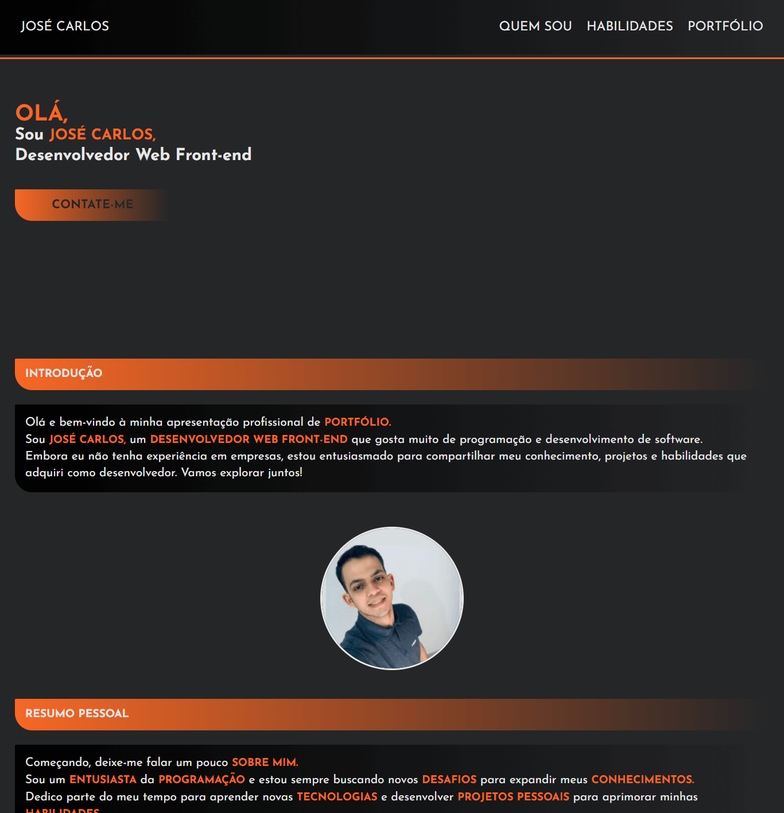

<h1 align="center">
  Portfólio
</h1>

  

## Projeto - Portfólio

Nesse portfólio, você encontrará uma introdução sucinta sobre minha pessoa, informações-chave sobre os
principais projetos que realizei, uma lista de minhas habilidades técnicas relevantes. Além disso, há um botão
para baixar meu currículo completo, que fornece detalhes adicionais. Por fim, disponibilizei um formulário
para facilitar o contato comigo.

Tecnologias Utilizadas:
* [HTML (Linguagem de marcação):](https://www.w3schools.com/html/html_intro.asp) Utilizado para estruturar e definir o conteúdo da página, incluindo cabeçalhos, parágrafos, listas e imagens.
* [CSS (Folha de estilos em cascata):](https://www.w3schools.com/css/css_intro.asp) Utilizado para estilizar os elementos da página, definindo cores, tamanhos, fontes e layout, proporcionando uma aparência visualmente atraente.
* [JavaScript:](https://developer.mozilla.org/pt-BR/docs/Web/JavaScript) Utilizado para adicionar interatividade à página, permitindo que o usuário selecione personagens e exiba informações dinamicamente.
* [Google Fonts:](https://fonts.google.com/) Utilizado para acessar e aplicar fontes personalizadas aos textos da página, melhorando a estilização e a legibilidade.
* [GitHub Pages:](https://pages.github.com/) Plataforma de hospedagem gratuita para projetos estáticos, permitindo que o site seja acessível na web.
* [Google Fonts Icons:](https://fonts.google.com/icons?icon.set=Material+Icons) Ele fornece os "Material Icons", que são ícones gráficos simplificados. Eles são utilizados em sites e aplicativos para melhorar a interface do usuário.
* [TinyJPG](https://tinyjpg.com/) e [TinyPNG:](https://tinypng.com/) O site utilizado é uma ferramenta online que comprime imagens JPEG e PNG sem perder muita qualidade. Ele reduz o tamanho dos arquivos de imagem usando algoritmos eficientes de compressão.
* [AvePDF:](https://avepdf.com/pt) Ele disponibiliza ferramentas online para manipular arquivos PDF, permitindo aos usuários converter, editar, combinar, compactar e desbloquear esses documentos.
* [FormSubmit:](https://formsubmit.co/) É um serviço online que simplifica o envio de dados de formulários em sites. Ao integrá-lo a um formulário HTML, ele encaminha os dados submetidos pelos usuários para um destino escolhido, como um e-mail. O serviço opera via URLs personalizados definidos no atributo "action" do formulário, processando e redirecionando os dados automaticamente.

Créditos:
* Criado por minha autoria | [José Carlos • jcddsj01](https://github.com/jcddsj01)

Implantação do Projeto no GitHub Pages: [Explore o projeto clicando aqui.](https://jcddsj01.github.io/portfolio/)

---

## Project - Portfolio

In this portfolio, you'll find a brief introduction to me, key information about my
projects I've carried out, a list of my relevant technical skills. In addition, there is a
button to download my full CV, which provides additional details. Finally, I have provided a form
to make it easier for you to contact me.

Technologies used:
* [HTML (HyperText Markup Language):](https://www.w3schools.com/html/html_intro.asp) Used to structure and define page content, including headings, paragraphs, lists and images.
* [CSS (Cascading Style Sheets):](https://www.w3schools.com/css/css_intro.asp) Used to style the elements of the page, defining colors, sizes, fonts and layout, providing a visually appealing appearance.
* [JavaScript:](https://developer.mozilla.org/pt-BR/docs/Web/JavaScript) Used to add interactivity to the page, allowing the user to select characters and display information dynamically.
* [Google Fonts:](https://fonts.google.com/) Used to access and apply custom fonts to page texts, improving stylization and readability.
* [GitHub Pages:](https://pages.github.com/) Free hosting platform for static projects, allowing the website to be accessible on the web.
* [Google Fonts Icons:](https://fonts.google.com/icons?icon.set=Material+Icons) It provides "Material Icons", which are simplified graphic icons. They are used on websites and applications to improve the user interface.
* [TinyJPG](https://tinyjpg.com/) e [TinyPNG:](https://tinypng.com/) The website used is an online tool that compresses JPEG and PNG images without losing much quality. It reduces the size of image files using efficient compression algorithms.
* [AvePDF:](https://avepdf.com/pt) It provides online tools for manipulating PDF files, allowing users to convert, edit, combine, compress and unlock these documents.
* [FormSubmit:](https://formsubmit.co/) It's an online service that simplifies sending data from forms on websites. By integrating it with an HTML form, it forwards the data submitted by users to a chosen destination, such as an e-mail. The service operates via customized URLs defined in the "action" attribute of the form, processing and redirecting the data automatically.

Credits:
* Created by me | [José Carlos • jcddsj01](https://github.com/jcddsj01)

Project deployment on GitHub Pages: [Explore the project by clicking here.](https://jcddsj01.github.io/portfolio/)
